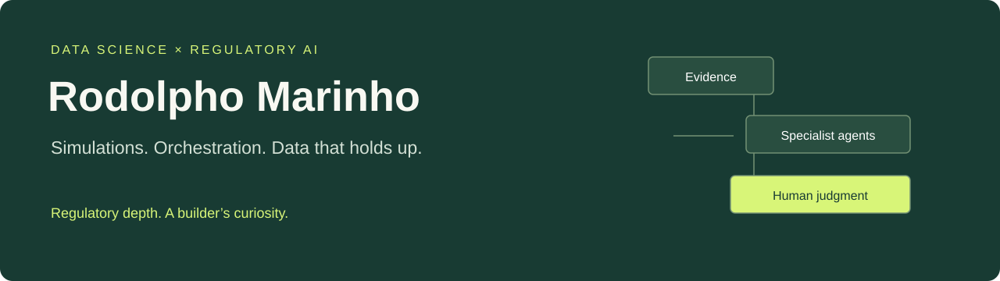
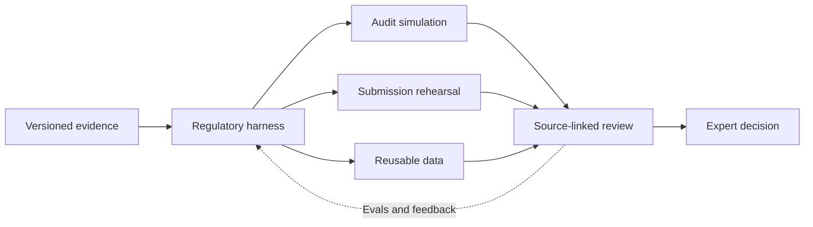

# Hi, I'm Rodolpho.

**Data Scientist. Regulatory backbone. Model-agnostic. Harness-first.**

[Explore my Regulatory AI workbench ↗](https://rodolphomarinho-dev.github.io/regulatory-ai/) · [Submission simulation](https://rodolphomarinho-dev.github.io/regulatory-ai/#demo-submission) · [Orchestration layers](https://rodolphomarinho-dev.github.io/regulatory-ai/#demo-orchestration)

I build simulations, regulatory harnesses and data products. The interesting part is making the evidence, the model and the human decision work together.

Across my workflow: **Astra · Ona · Perplexity · Antigravity · Gemini · ChatGPT · Codex.** Different models, platforms and tools. The task and the evals guide the choice.

More than 20 years in healthcare and medical devices. 11+ years at Roche Diagnostics. A background across field service, team leadership, Post-Market Quality and Regulatory Affairs.

## A few things on my bench

| Work | What I'm building | Where it stands |
| --- | --- | --- |
| Audit preparation | Multi-agent challenge packages: focused questions, evidence links and reviewer handoffs | Built; pilot preparation |
| Submission rehearsal | Separate simulation contracts for Pre-Submission discussion and submission challenge review | Prototype; evaluation pending |
| Regulatory data | Structured authority feedback, reusable trend intelligence and data contracts | Loading pilot delivered; wider integration evolving |

## The engineering behind it

**Context engineering → tools → orchestration → structured outputs → evals → human review.**

Simulation harnesses. Evidence pipelines. Orchestration layers. Source-linked handoffs that an expert can actually inspect. The accountable person keeps the final call.

I test the uncomfortable questions too: what did the workflow miss, what did it invent, and what happens when the source is incomplete?

The **regulatory-ai** repository contains a public workbench with synthetic, deterministic examples. No company documents, live models or production-system connections. Browse its README for the architecture, fixture checks and working examples.

## Beyond the code

I bring Regulatory, Quality, Data and IT people into the same conversation. Define the decision. Agree who owns what. Build something useful. Learn from the people using it.

Sometimes that means a well-designed expert service rather than another self-service portal.

[Let's compare notes on LinkedIn ↗](https://www.linkedin.com/in/rodolpho-marinho-311777437/)

*Personal portfolio. Project summaries describe my contributions and their current stage; synthetic examples do not demonstrate regulatory effectiveness or represent an employer's endorsement.*
